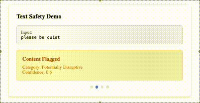

# Using Google Cloud Natural Language API to Moderate Text



Text moderation analyzes written content to detect language that may be inappropriate, harmful, offensive, or unsafe. This includes identifying:

* Profanity or abusive language: Words or phrases that could offend or harm
* Hate speech: Content targeting groups based on attributes like race, gender, or religion
* Harassment: Language intended to intimidate, bully, or demean others
* Sensitive or dangerous content: Discussions of violence, explicit material, or risky behavior

The Google Cloud Natural Language API moderates text by assigning safety ratings with confidence scores (0 to 1). These scores help developers detect and manage harmful content while maintaining user trust.

## Key Features of the Natural Language API

The API provides powerful tools for text analysis:

* Entity Extraction: Identifies names, places, or dates in text
* Sentiment Analysis: Determines whether text is positive, neutral, or negative
* Text Classification: Categorizes text into topics like sports or technology
* Text Moderation: Detects harmful content and assigns safety ratings for categories like profanity and hate speech

## Safety Thresholds

The API supports four moderation thresholds to tailor safety settings:

* Block Always: Shows all content regardless of safety ratings
* Block Only High: Blocks content with a high probability of being unsafe
* Block Medium and Above: Blocks content with a medium or high probability of being unsafe
* Block Low and Above: Blocks content with a low, medium, or high probability of being unsafe

These thresholds allow developers to customize moderation to their platform's requirements.

## Common Use Cases

Text moderation is essential for maintaining safe online spaces. Key applications include:

* Social Media Platforms: Filtering offensive comments or posts
* Customer Feedback Systems: Screening reviews for inappropriate content
* Community Forums: Automatically flagging harmful language

## How Detection Works

When the API detects unsafe content, it:

* Assigns confidence scores for categories like profanity and hate speech
* Applies user-defined safety thresholds
* Takes action (e.g., blocking, flagging, or providing feedback)
* Returns detailed feedback about flagged categories and their confidence scores

## Implementation Examples

### Python Example

```python
from google.cloud import language_v1

def moderate_text(content, threshold=0.7):
    client = language_v1.LanguageServiceClient()
    document = {"content": content, "type_": language_v1.Document.Type.PLAIN_TEXT}
    response = client.analyze_moderation_text(document=document)

    flagged_categories = []
    for category in response.moderation_response.categories:
        if category.confidence >= threshold:
            flagged_categories.append(f"{category.name} (confidence: {category.confidence})")

    if flagged_categories:
        return f"Comment blocked. Detected: {', '.join(flagged_categories)}"
    return "Comment approved."

# Example usage
user_comment = "I hate you! You're so stupid."
result = moderate_text(user_comment, threshold=0.7)
print(result)
```

Example Outputs:

For unsafe content:
```
Comment blocked. Detected: profanity (confidence: 0.92), hate_speech (confidence: 0.87)
```

For safe content:
```
Comment approved.
```

### Using curl

```bash
curl -X POST \
    -H "Authorization: Bearer $(gcloud auth print-access-token)" \
    -H "Content-Type: application/json" \
    https://language.googleapis.com/v1/documents:moderateText \
    -d '{
      "document": {
        "content": "shut up",
        "type": "PLAIN_TEXT"
      }
    }'
```

This returns safety ratings with confidence scores for harmful categories.

## Using Gemini for Additional Safety

Gemini, developed by Google DeepMind, offers built-in safeguards for:

* Harassment
* Hate speech
* Sexually explicit content
* Dangerous content

### Key Gemini Features

* Default Settings: Block content with medium or higher probability
* Adjustable Parameters: Customize safety settings for categories and thresholds
* Detailed Feedback: Provides feedback for blocked content with probabilities

### Gemini Implementation Example

```python
safety_settings = {
    "category": "hate_speech",
    "threshold": "BLOCK_LOW_AND_ABOVE"
}
```

Example use case: A chatbot for kids may block even low-probability unsafe content for stricter safety.

## Other Programming Languages

The API supports multiple languages, including:

* Java
* Go
* Node.js

## Conclusion

The Google Cloud Natural Language API and Gemini empower developers to create safer digital environments by detecting and managing harmful content. With flexible thresholds, actionable feedback, and support for multiple languages, these tools help tailor moderation to your platform's needs. 

## Learn More
Learn more in Responsible AI for Developers: Privacy & Safety from Google Cloud Skills Boost:
https://www.cloudskillsboost.google/paths/183/course_templates/1036/video/513303

Learn safety skills hands on in a lab: see Safeguarding with Vertex AI in Gemini on the Software Girls channel and solve the lab on your own
https://www.youtube.com/watch?v=SM2ShTcMWVs

## Source Code for GIF

I wrote the code for the `gif-source-code` folder in [CodePen](https://codepen.io/captainanonymous00/pen/WbeXJMG) using Babel.

### Files
- `index.html`: The HTML structure for the project.
- `style.css`: The CSS for styling.
- `script.js`: The JavaScript code written in ES6+.

You can view or edit the live version of this code on CodePen: [https://codepen.io/captainanonymous00/pen/WbeXJMG](https://codepen.io/captainanonymous00/pen/WbeXJMG).

To use this code locally, download the files in the `gif-source-code` folder and open `index.html` in your browser.

## License

This repository is dedicated to the public domain under the [Creative Commons Zero Universal (CC0 1.0) Public Domain Dedication](https://creativecommons.org/publicdomain/zero/1.0/).

You are free to:
- Copy, modify, distribute, and perform the work, even for commercial purposes, all without asking permission.

For more details, see the [LICENSE file](./LICENSE).


